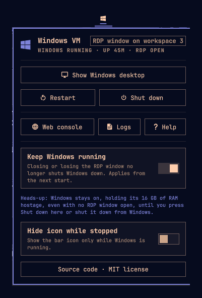

# Windows VM for Omarchy

**See at a glance whether your Windows VM is running, jump to its desktop, and restart or shut it down from the bar.**

An [Omarchy](https://omarchy.org/) bar widget for the built-in Windows VM, the one you set up with `omarchy-windows-vm install`. It adds a small Windows logo to the top right of your bar and a panel with everything you need to manage the VM.



## What you get

- **Status on your bar.** The Windows logo is bright while Windows runs, dim when it's stopped, and pulses while it starts or shuts down. Hover it for details, e.g. *Windows running · up 1h 5m · RDP open*.
- **One click to the desktop.** Right-click the icon, or press **Show Windows desktop** in the panel. If the RDP window is already open on another workspace, you're taken to it. If it isn't open, it reconnects, and if Windows isn't running, it starts it.
- **Restart and Shut down, with a safety catch.** Both ask for a second click, because Windows closes every app it's running.
- **Keep Windows running when RDP closes (optional).** By default, closing the RDP window shuts Windows down, just like Omarchy's own launcher. Turn this on and Windows keeps running with your apps, SSH sessions and background jobs until you shut it down. The panel reminds you how much RAM the VM keeps in use, so it's never forgotten.
- **Logs for every start.** Each start, restart and shutdown is written to a log, with FreeRDP's own messages included. When an RDP session drops unexpectedly, the log says why.
- **Web console and help.** Open the VM's screen in your browser, useful while it boots or if RDP won't connect. A built-in **Help** section explains every button.

## Requirements

- Omarchy with the Windows VM installed: `omarchy-windows-vm install`.
- Docker access. If your user is in the `docker` group, the icon updates silently. Otherwise the status stays unknown, and starting or stopping asks for your password as usual.

There are no other dependencies. The plugin only uses tools Omarchy already ships: `omarchy-windows-vm`, `docker`, `hyprctl` and `uwsm-app`.

## Quick start

```sh
omarchy plugin add https://github.com/Somnius/Windows-VM-for-Omarchy.git --enable
```

The Windows logo appears on the right side of the bar. **Left-click** it to open the panel.

## Using it

| On the bar icon | Does |
|---|---|
| **Left-click** | Opens the panel |
| **Right-click** | Goes to the Windows desktop (starts Windows if needed) |
| **Hover** | Status, uptime and whether the RDP window is open |

| In the panel | Does |
|---|---|
| **Show Windows desktop** / **Reconnect RDP** / **Start Windows** | Whichever fits right now: focus the open window, reconnect, or start the VM |
| **Restart** | Clean shutdown, then start again and reconnect (click twice) |
| **Shut down** | Clean shutdown of Windows (click twice) |
| **Web console** | Opens `http://127.0.0.1:8006` in your browser |
| **Logs** | Opens the logs folder |
| **Help** | Shows how the plugin works |
| **Keep Windows running** | Windows stays up when the RDP window closes |
| **Hide icon while stopped** | Shows the icon only while Windows runs |

Shutting Windows down from its own Start menu works too. The icon goes dim once the VM has stopped.

### About "Keep Windows running"

Omarchy's launcher treats a closed RDP window as "I'm done" and shuts Windows down, which also ends anything still running there. With **Keep Windows running** on, only the window closes. Reopen it any time from the bar and you're back in the same session with your apps intact.

The catch: the VM keeps the RAM you gave it (the `RAM_SIZE` you chose at install) until you press **Shut down** or shut down from Windows. The panel shows a reminder while the option is on.

The setting applies from the next start or reconnect made through the plugin.

## Logs

Every action writes one log to `~/.local/state/windows-vm/logs/` (it follows `$XDG_STATE_HOME`), for example `launch-20260927-101545.log`. The 30 newest are kept. FreeRDP runs with `WLOG_LEVEL=INFO`, so the reason an RDP session ended is recorded.

## Keybindings and scripting

Every panel action is also a command:

```sh
omarchy-shell lef.windows-vm show       # focus the Windows desktop, or start/reconnect
omarchy-shell lef.windows-vm restart
omarchy-shell lef.windows-vm stop
omarchy-shell lef.windows-vm status     # state as JSON
omarchy-shell lef.windows-vm toggle     # open/close the panel
```

For example, to bind Super+Shift+W to the Windows desktop, add a binding in `~/.config/hypr/bindings.lua` that runs `omarchy-shell lef.windows-vm show`.

## Settings

The panel saves its two settings to `~/.config/omarchy/windows-vm/config.json`:

```json
{
  "hideWhenStopped": false,
  "keepAlive": false
}
```

## How it works

- Every 5 seconds (2 while an action runs), the plugin asks Docker for the `omarchy-windows` container's state, start time and `RAM_SIZE`, and asks Hyprland whether the `Windows VM - Omarchy` window is open. The Docker template extracts only those fields, so the container's stored Windows password never reaches the plugin.
- Actions run `Launch.sh`, which calls Omarchy's own `omarchy-windows-vm launch`, `launch --keep-alive` or `stop`. It runs detached through `uwsm-app`, so an open RDP window survives a restart of the Omarchy shell.
- Before starting, `Launch.sh` clears the setgid bit on `~/Windows` (only on your own directory, and nothing else). Dockur's file sharing sets that bit, and Omarchy's launcher then refuses to start ([omacom/omarchy#10256](https://github.com/omacom/omarchy/issues/10256)).
- The plugin never edits the VM's Docker configuration and never needs root itself.

## Troubleshooting

- **The icon stays dim and the panel says "No Docker access".** Your user can't talk to Docker without a password. Start Windows from the panel (it asks for your password), or add yourself to the `docker` group.
- **Start does nothing / "That took too long".** Open **Logs** and read the newest file. It contains the launcher's full output.
- **The RDP window closed by itself.** With **Keep Windows running** on, Windows is still up: press **Show Windows desktop**. The newest log shows why the session ended.

## Remove

```sh
omarchy plugin remove lef.windows-vm
rm -rf ~/.config/omarchy/windows-vm ~/.local/state/windows-vm   # optional: settings and logs
```

Removing the plugin doesn't touch the Windows VM or its disk.

## License

[MIT](LICENSE)
