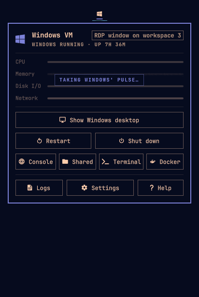
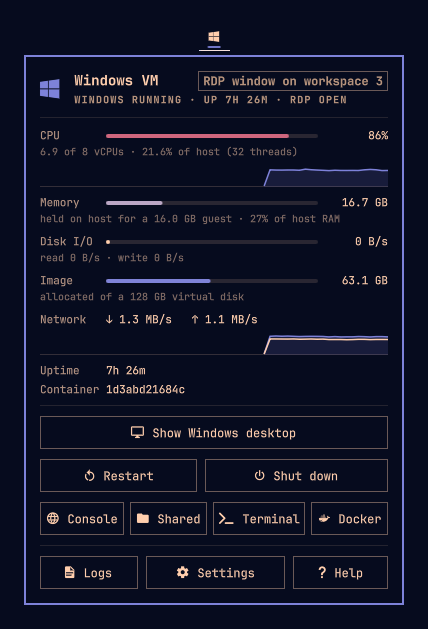
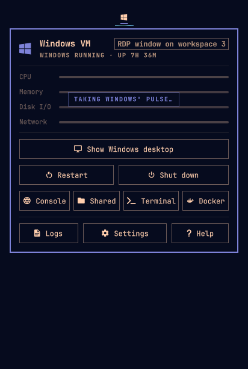
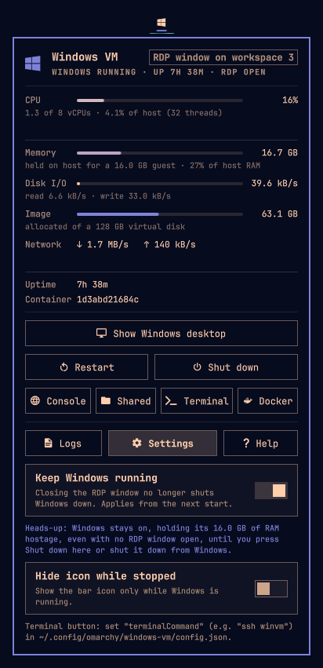
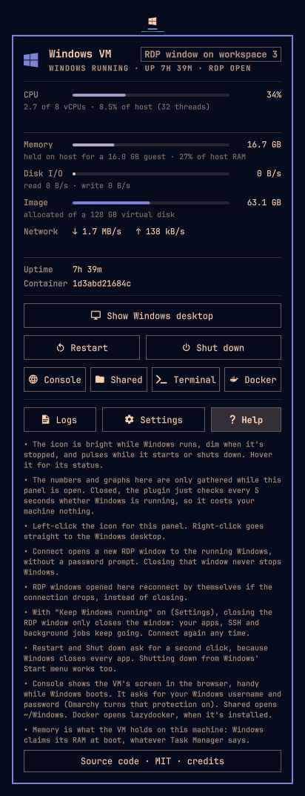

# Windows VM for Omarchy

**Control your Windows VM from the bar: connect, restart or shut it down, and let RDP reconnect by itself when the connection drops. Its live numbers cost your machine nothing while you aren't looking: they're only gathered while the panel is open.**

An [Omarchy](https://omarchy.org/) bar widget for the built-in Windows VM, the one you set up with `omarchy-windows-vm install`. It puts a small Windows logo at the top right of your bar, with a panel for everything else.



## What you get

- **Status on your bar.** The Windows logo is bright while Windows runs, dim when it's stopped, and pulses while it starts or shuts down. Hover it for a summary, e.g. *Windows running · up 7h 20m · RDP open*.
- **Costs nothing while you aren't looking.** With the panel closed, the plugin only checks whether Windows is running: one small process every 5 seconds. There is no resource tracking, no Docker calls, and no window polling in the background. Numbers and graphs are gathered only while the panel is open, start fresh each time, and are thrown away when it closes.
- **Live resource use, on demand.** Open the panel for CPU against the VM's vCPUs and against your machine, memory held on the host, disk I/O, the disk image's allocated size, network down/up, uptime and the container ID (click it to copy). CPU and network come with live graphs. The first numbers arrive in about a second, with a placeholder until then. No Docker access is needed for any of it.
- **Connect without a password prompt.** When Windows is running, **Connect** opens an RDP window straight into your session using the credentials Omarchy saved. The password travels through a file descriptor, so it's never visible in the process list. Closing that window never stops Windows.
- **RDP that reconnects by itself.** If the connection through Docker drops, the window reconnects instead of disappearing. This works for windows opened by Connect as well as by Start and Restart.
- **Keep Windows running (optional).** By default, closing the RDP window shuts Windows down, just like Omarchy's own launcher. Turn this on and Windows keeps running with your apps, SSH sessions and background jobs; reconnect whenever you like. The panel reminds you how much RAM that holds.
- **Restart and Shut down, with a safety catch.** Both ask for a second click, because Windows closes every app it's running.
- **Other ways in:** the **Console** (the VM's screen in your browser, handy while it boots), the **Shared** folder (`~/Windows`), an optional **Terminal** button (e.g. `ssh winvm`), and **Docker**, which opens lazydocker when it's installed.
- **Logs for every start and connection,** with FreeRDP's own messages, so you can see why a session ended.

## Screenshots

| Live numbers | While they load (about a second) |
|---|---|
|  |  |

| Settings, with the RAM reminder | Built-in help |
|---|---|
|  |  |

## Requirements

- Omarchy with the Windows VM installed: `omarchy-windows-vm install`.
- Docker using cgroup v2 (the Arch default).

It uses only tools Omarchy already ships: `omarchy-windows-vm`, `xfreerdp3`, `hyprctl`, `jq`, `uwsm-app`, `xdg-terminal-exec` and `wl-copy`. Status and numbers need no special permissions. Starting and stopping go through Omarchy's own command, which asks for your password if your user isn't in the `docker` group.

## Quick start

```sh
omarchy plugin add https://github.com/Somnius/Windows-VM-for-Omarchy.git --enable
```

The Windows logo appears on the right side of the bar. **Left-click** it for the panel, or **right-click** it to go straight to the Windows desktop.

## Using it

| On the bar icon | Does |
|---|---|
| **Left-click** | Opens the panel |
| **Right-click** | Goes to the Windows desktop: focuses the RDP window, connects, or starts Windows |
| **Hover** | Status, uptime and whether the RDP window is open |

| In the panel | Does |
|---|---|
| **Show Windows desktop** / **Connect (RDP)** / **Start Windows** | Whichever fits: focus the open window, connect to the running VM, or start it |
| **Restart** | Clean shutdown, then start again and connect (click twice) |
| **Shut down** | Clean shutdown of Windows (click twice) |
| **Console** | Opens `http://127.0.0.1:8006`, the VM's screen in your browser. It asks for your **Windows** username and password (see below) |
| **Shared** | Opens `~/Windows`, which Windows sees as `\\host.lan\Data` |
| **Terminal** | Runs your `terminalCommand` in a terminal (shown only when set) |
| **Docker** | Opens lazydocker (shown only when it's installed) |
| **Logs** | Opens the logs folder |
| **Settings** | Keep Windows running · Hide icon while stopped |
| **Help** | How it all works |

Shutting Windows down from its own Start menu works too. The icon goes dim once the VM has stopped.

## The numbers

Everything is read without privileges from the container's cgroup and the VM process's `/proc` entry, and only while the panel is open: every 2 seconds, starting the moment it opens. With the panel closed, the plugin asks one thing every 5 seconds: is Windows running, and since when. A reading takes a few milliseconds.

| Figure | Source |
|---|---|
| Running | a Docker container's cgroup holding the `qemu-system-*` process named `windows` |
| CPU | cgroup `cpu.stat`, against the guest's vCPUs (qemu's `-smp`) and against the host |
| Memory | cgroup `memory.current`, shown against your machine's RAM |
| Disk I/O | cgroup `io.stat`, the busiest single device (so encrypted disks aren't counted twice) |
| Image | allocated blocks of the sparse `~/.windows/data.img` (hidden if unreadable) |
| Network | `eth0` in the VM's network namespace |
| Uptime | the VM process's start time |
| Starting | Docker reports the container running before qemu exists (needs Docker access; otherwise it shows as stopped) |

Memory is what the VM takes from your machine, not what Task Manager shows: Windows claims its RAM at boot.

## The web console asks for a login

Omarchy installs the VM with Dockur's `PROTECT` option, which puts a password on the web console at `http://127.0.0.1:8006`, even though it's only reachable from your own machine. Log in with the **Windows username and password** you chose when installing the VM (Omarchy keeps a copy in `~/.config/windows/credentials`).

## About "Keep Windows running"

Omarchy's launcher treats a closed RDP window as "I'm done" and shuts Windows down, which also ends anything still running there. With **Keep Windows running** on, only the window closes. Connect again any time from the bar, and you're back in the same session with your apps intact.

The catch: the VM keeps the RAM you gave it (`RAM_SIZE` at install) until you press **Shut down** or shut down from Windows. The panel reminds you while the option is on. The setting applies from the next start.

## About auto-reconnect

The RDP connection runs through Docker's port forwarding. When that link breaks, FreeRDP logs `Network disconnect!` and, without auto-reconnect, the window closes even though Windows is fine.

The plugin adds FreeRDP's `/auto-reconnect` (up to 5 attempts):

- **Connect** starts FreeRDP itself with it.
- **Start** and **Restart** run Omarchy's launcher with the plugin's `bin/shim` directory first on its `PATH`. The launcher runs `xfreerdp3` by name, so it gets a tiny wrapper that adds the two flags and hands everything to `/usr/bin/xfreerdp3` through a file descriptor. Only the unprivileged RDP client is wrapped. The launcher and everything it runs as root are untouched, and no system file is changed.

## Settings

The panel saves settings to `~/.config/omarchy/windows-vm/config.json`:

```json
{
  "hideWhenStopped": false,
  "keepAlive": false,
  "terminalCommand": ""
}
```

`terminalCommand` is the only setting without a switch in the panel. Set it to any command to get a **Terminal** button, e.g. `"ssh winvm"` if you've set up SSH into Windows. It runs in your terminal with `sh -c`.

## Logs

Every start, restart, shutdown and connection writes one log to `~/.local/state/windows-vm/logs/` (it follows `$XDG_STATE_HOME`). The 30 newest are kept. FreeRDP runs with `WLOG_LEVEL=INFO`, so the reason an RDP session ended is recorded.

## Scripting

Every main action is also a command:

```sh
omarchy-shell lef.windows-vm show       # focus the Windows desktop, or connect/start
omarchy-shell lef.windows-vm restart
omarchy-shell lef.windows-vm stop
omarchy-shell lef.windows-vm status     # state as JSON; live numbers only while the panel is open ("statsLive")
omarchy-shell lef.windows-vm toggle     # open/close the panel
```

## How it works

- `bin/Sample.sh` prints one JSON line with raw counters; the plugin turns two samples into rates. It never touches the Docker socket. With the panel closed it runs as `Sample.sh --state` and reads nothing but whether qemu runs and its start time.
- The only Docker call, `docker inspect` for the "starting" state, runs only while the panel is open or an action is in progress, and only when no VM process exists yet. The RDP window is looked up only when needed: panel open, hovering the icon, a click, or an action in progress.
- Scripts report failures (a declined password prompt, missing credentials, a session already open) to `$XDG_RUNTIME_DIR/windows-vm/status.json`, so the panel shows the reason at once. Problems inside FreeRDP after it starts (e.g. Windows rejecting the password) are in the log; the panel stops waiting after 45 seconds.
- Actions run `Launch.sh` (start, restart, shut down) or `bin/Connect.sh`, detached through `uwsm-app`, so an open RDP window survives a restart of the Omarchy shell.
- Shut down and Restart close the RDP windows first. A launcher still waiting on its window stops the VM itself; the plugin waits for it rather than stopping the VM underneath it.
- Before starting, `Launch.sh` clears the setgid bit on your own `~/Windows` and nothing else. Dockur's file sharing sets that bit, and Omarchy's launcher then refuses to start ([omacom/omarchy#10256](https://github.com/omacom/omarchy/issues/10256)).
- The plugin never edits the VM's Docker configuration and never needs root itself.

## Troubleshooting

- **The icon stays dim while Windows is booting.** Status comes from the VM process, which appears a little after the container starts. With the panel open (and Docker access) it shows "starting". A click always checks first, so it never starts Windows twice.
- **Connect says a session is already open.** Windows allows one RDP session. Another window is open or still reconnecting: use **Show Windows desktop**, or close the other one.
- **"That didn't finish."** Open **Logs** and read the newest file: it has the full output.
- **The RDP window closed by itself.** With **Keep Windows running** on, Windows is still up: press **Connect**. The newest log shows why the session ended.

## Remove

```sh
omarchy plugin remove lef.windows-vm
rm -rf ~/.config/omarchy/windows-vm ~/.local/state/windows-vm   # optional: settings and logs
```

Removing the plugin doesn't touch the Windows VM or its disk.

## Credits

Version 1.1.0 builds on ideas and code from **[omarchy-winvm](https://github.com/jonspinks/omarchy-winvm) by Jon Spinks** (MIT): the unprivileged resource sampling, direct reconnect with saved credentials, the resource meters, and handing the shutdown to a waiting launcher. Thank you, Jon! The adapted parts are listed in [NOTICE](NOTICE), together with his license. Each adapted file carries a header saying so.

## License

[MIT](LICENSE). Third-party notices: [NOTICE](NOTICE). Changes: [CHANGELOG](CHANGELOG.md).
